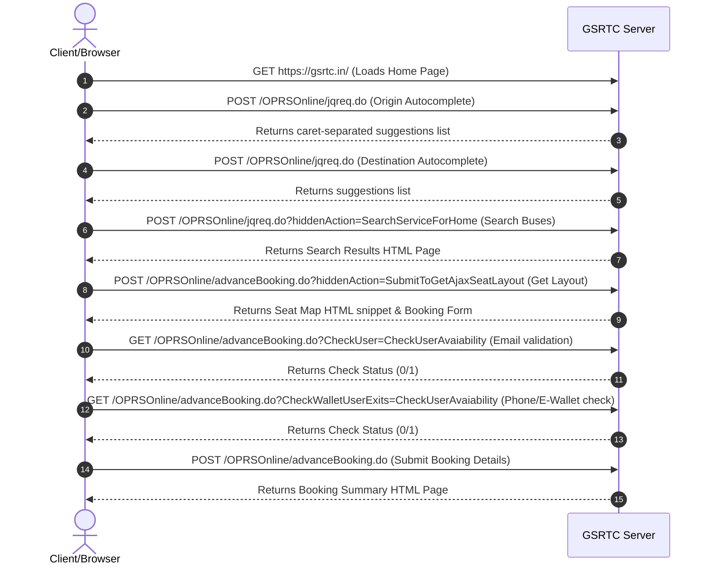

# GSRTC Ticket Booking: API Analysis & Automation Guide

This document provides a complete technical analysis of the Gujarat State Road Transport Corporation (GSRTC) ticket booking system, its underlying API structure, request/response data mappings, and strategies for building a modern, high-performance clone with superior UX.

---

## 1. Booking Flow Architecture

Below is the sequential workflow of the booking system, from searching to the final pre-payment page:



---

## 2. API Reference & Data Mappings

The GSRTC booking engine runs on Java Servlets (`.do` endpoints) and relies on standard form submissions and AJAX requests.

### Step 2.1: Autocomplete Search API
As the user types into the Source or Destination inputs, autocomplete calls are made.

* **Endpoint**: `https://gsrtc.in/OPRSOnline/jqreq.do?`
* **Method**: `POST`
* **Headers**: `Content-Type: application/x-www-form-urlencoded; charset=UTF-8`
* **Payload (Origin)**:
  ```properties
  hiddenAction=LoadFromPlaceList
  term=JUNAGADH
  matchStartPlace=JUNAGADH
  ```
* **Payload (Destination)**:
  ```properties
  hiddenAction=LoadTOPlaceList
  term=DHORAJI
  matchEndPlace=DHORAJI
  ```
* **Response Format**: Caret-separated (`^`) string of suggestions. Each suggestion follows the pattern `placeId:placeCode:placeName`.
  * **Example Response**:
    ```text
    57:JND:JUNAGADH^4993:Junag:Junagadh (Local)^9409:Jun436:Junagadh Amreli^10191:AZADC:JUNAGADH AZAD CHOK^...
    ```
    * `57` represents the `hiddenStartPlaceID`.
    * `JND` represents the `txtStartPlaceCode`.
    * `JUNAGADH` represents the `hiddenStartPlaceName`.

---

### Step 2.2: Bus Search API
Submits the parameters of the search query and returns the bus listings page.

* **Endpoint**: `https://gsrtc.in/OPRSOnline/jqreq.do?hiddenAction=SearchServiceForHome`
* **Method**: `POST`
* **Payload Parameters**:
  ```properties
  matchStartPlaceA=JUNAGADH
  matchEndPlaceA=DHORAJI
  hiddenStartPlaceName=JUNAGADH
  hiddenEndPlaceName=DHORAJI
  hiddenStartPlaceID=57
  hiddenEndPlaceID=64
  txtStartPlaceCode=JND
  txtEndPlaceCode=DRJ
  txtJourneyDate=30/06/2026
  hiddenOnwardJourneyDate=30/06/2026
  hiddenCurrentDate=23/06/2026
  selectNoOfPassengers=1
  hiddenJourneyType=O
  singleLady=N
  hiddenLanguage=English
  ```
* **Response Format**: `text/html` (Returns the page displaying the search results).
  * In the HTML, available buses display a Seat Selection button with an ID structure `#selectButton{index}` (e.g., `#selectButton0`).
  * The button container holds a detailed string representing the service ID and bus details (`radOnwardServiceID`):
    `47934,21,AC LUXURY,204,0,00:45,06:00,JUNAGADH,JUNAGADH,JAMNAGAR,0600JNDJMNAC45,Y`

---

### Step 2.3: Seat Layout API
Fetched dynamically via AJAX when the user clicks the "Select Seat/s" button of a specific bus.

* **Endpoint**: `https://gsrtc.in/OPRSOnline/advanceBooking.do`
* **Method**: `POST`
* **Query Params**:
  * `hiddenAction`: `SubmitToGetAjaxSeatLayout`
  * `radOnwardServiceID`: `47934,21,AC LUXURY,204,0,00:45,06:00,JUNAGADH,JUNAGADH,JAMNAGAR,0600JNDJMNAC45,Y`
  * `slNo`: `0` (Index of the bus item clicked)
* **Response Format**: `text/html` (Returns an HTML table snippet rendering the seat coordinates and inputs).
  * **Booked Seats** are represented by images: ``
  * **Available Seats** are represented by images with IDs corresponding to the layout coordinates: ``

---

### Step 2.4: Passenger Background Validation
As the user enters their email and mobile number, background checks verify account status:

1. **Email Availability Check**:
   * **Endpoint**: `GET https://gsrtc.in/OPRSOnline/advanceBooking.do?CheckUser=CheckUserAvaiability&EmailId=DUMMYEMAIL@GMAIL.COM`
   * **Response**: `0` or `1`
2. **E-Wallet and Mobile Account Verification**:
   * **Endpoint**: `GET https://gsrtc.in/OPRSOnline/advanceBooking.do?CheckWalletUserExits=CheckUserAvaiability&MobileNoEmail=9924513876,DUMMYEMAIL@GMAIL.COM`
   * **Response**: `0` or `1`

---

### Step 2.5: Booking Form Submission
Submits all passenger details and coordinates to register the booking.

* **Endpoint**: `https://gsrtc.in/OPRSOnline/advanceBooking.do`
* **Method**: `POST`
* **Key Payload Parameters**:
  ```properties
  hiddenAction=GetAjaxFareDetailsOnward
  hiddenJourneyType=O
  totalSeatsTodisplay=1
  seatNumbersTodisplay=5
  selhidseats=5
  hidNo_ofSeats=1
  seatrowcols=7934-O5
  selhidrowcols=7934-O5
  txtEmailID0=DUMMYEMAIL@GMAIL.COM
  txtMobileNo0=9924513876
  txtNameArray0=JOHN DOE
  txtAgeArray0=30
  selectGenderArray0=M
  selectPickupPoint0=91,06:00,1
  selectDropOffPoint0=81,06:45,null
  hiddenOnwardPickupPointDetails=JUNAGADH--06:00
  hiddenOnwardDropOffPointDetails=DHORAJI--06:45
  hiddenAjaxEmailId=DUMMYEMAIL@GMAIL.COM
  hiddenAjaxMobileNo=9924513876
  hiddenOnwardServiceInfo=47934,21,AC LUXURY,204,0,00:45,06:00,JUNAGADH,JUNAGADH,JAMNAGAR,0600JNDJMNAC45,Y
  ```
* **Response Format**: `text/html` (Returns the final **Passenger details summary** page displaying billing info, discount details, and E-Wallet account assignments).

---

## 3. Notable Site Quirks & Workarounds

During automation script design, several quirks were bypassed programmatically:
1. **Modal Ads Block Clicks**: The site launches with an alert popup overlay (`#popup-overlay`). We clicked `#popup-close` to close it.
2. **Read-Only Date Inputs**: The onward date input (`#datepickerOA`) has the `readonly` HTML attribute to force calendar clicks. We programmatically removed this attribute via `removeAttribute('readonly')` and updated the value directly, triggering the `change` events.
3. **Strict Phone Number Validation**: The phone input field rejects sequential or repetitive digits (e.g., `9876543210` or `9999999999`) displaying an alert dialog saying `"Invalid mobile number: Repetitive or sequential patterns are not allowed."`. We resolved this by using a realistic, non-sequential Indian mobile format: `9924513876`.

---

## 4. Designing a High-Performance Modern Clone

To build a version of this website with **premium design, high performance, and visual appeal**, use the following architecture:

### 4.1 UI/UX Architecture
* **Stack**: Next.js (App Router), Tailwind CSS, Framer Motion (for transitions), and Radix UI primitives.
* **Theme**: Sleek Dark Mode or Clean Glassmorphism. Use a tailored HSL palette (e.g., deep sapphire `#0F172A` as slate background, vibrant indigo `#4F46E5` for interactive highlights, and harmonized success/danger states).
* **Typography**: Outfit or Inter Google fonts instead of standard browser sans-serifs.
* **Component Improvements**:
  * **Search Form**: Interactive search bar with floating labels, auto-detecting current location.
  * **Bus Cards**: Dynamic expanding seat layouts with slide animations. Instead of an unstyled table layout, display a realistic SVG 3D-styled bus cabin representation with distinct coloring for window/aisle seats, ladies' seats, and sleeping berths.
  * **Loading States**: Shimmer skeletons during fetch cycles instead of a static GIF loader.

### 4.2 Performance Enhancements
1. **Cached Autocomplete**: The station codes and names (e.g., `57:JND:JUNAGADH`) change very rarely. Cache this dataset in client-side memory or LocalStorage. Load it once on site load to provide **instant, zero-latency autocomplete** search.
2. **GraphQL or REST BFF**: Combine the search results page and seat layout fetching. When fetching buses, fetch seat availability metadata in parallel so the layout loads instantly when clicked.
3. **JSON APIs**: Eliminate the HTML page payload responses. Build APIs returning clean JSON data and render components dynamically on the client, saving up to 80% bandwidth.

---

## 5. How to Run the Automation Script

The workspace includes a complete automated Playwright script `book_complete.js` which performs the entire flow end-to-end and captures screenshot states.

### Prerequisites:
1. **Node.js**: Verify installation (`node -v`).
2. **Dependencies**: `playwright` is installed in this workspace.

### Commands to Run:
```powershell
# Run the complete booking automation flow (non-headless to watch interactions)
node book_complete.js
```

### Generated Files in Workspace:
* [book_complete.js](file:///d:/Yajuvendra/GSRTC/book_complete.js) - The automation script.
* [before_book.png](file:///d:/Yajuvendra/GSRTC/before_book.png) - Screenshot showing selected seat and passenger forms filled.
* [after_book.png](file:///d:/Yajuvendra/GSRTC/after_book.png) - Screenshot showing successful booking details page.
* [booking_network_logs.json](file:///d:/Yajuvendra/GSRTC/booking_network_logs.json) - Full network traces.
* [print_booking_requests.js](file:///d:/Yajuvendra/GSRTC/print_booking_requests.js) - A helper script to print formatted endpoint details.
